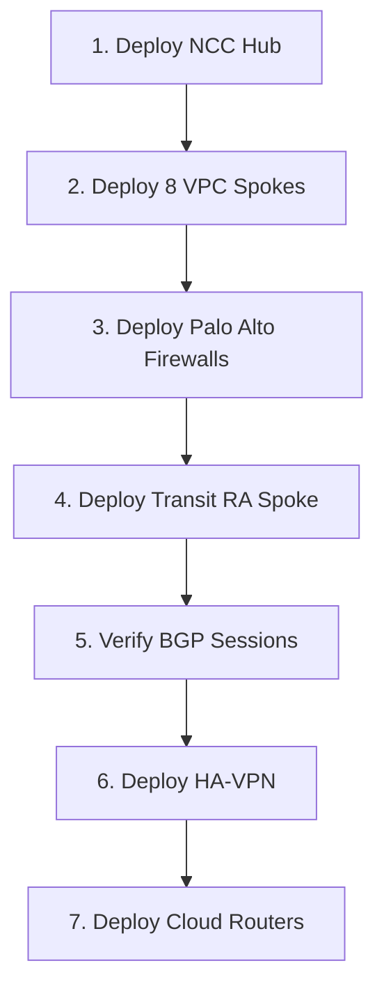

# NCC Hub-Spoke Quick Reference

## Architecture Summary

```
╔═══════════════════════════════════════════════════════════════════════════╗
║                    NCC Hub (carrier-ncc-hub-prod)                         ║
║                   Project: prj-prd-gcp-40036-mgmt-nethub                  ║
╚═══════════════════════════════════════════════════════════════════════════╝
                                    │
        ┌───────────────────────────┼───────────────────────────┐
        │                           │                           │
        ▼                           ▼                           ▼
┌─────────────────┐        ┌─────────────────┐       ┌─────────────────┐
│  VPC Spokes (8) │        │   RA Spoke (1)  │       │   Future        │
│                 │        │                 │       │   Expansion     │
│ • M1P           │        │ Transit VPC     │       │                 │
│ • M1NP          │        │ w/ Palo Alto    │       │ • Model 5       │
│ • M3P           │        │                 │       │ • On-Prem       │
│ • M3NP          │        │ Interface 0 ←→  │       │   (via VPN)     │
│ • FW Data       │        │ Interface 1 ←→  │       │                 │
│ • FW Mgmt       │        │                 │       │                 │
│ • Shared Svc    │        │ BGP Peers:      │       │                 │
│ • Transit VPC   │        │  - ASN 65001    │       │                 │
│                 │        │  - ASN 65002    │       │                 │
└─────────────────┘        └─────────────────┘       └─────────────────┘
```

---

## Component Inventory

### NCC Hub
| Component | Name | Project | Location |
|-----------|------|---------|----------|
| **Hub** | carrier-ncc-hub-prod | prj-prd-gcp-40036-mgmt-nethub | global |

### VPC Spokes (8 Total)

#### Model Spokes (4)
| Spoke | VPC Name | Project | Region | Zone |
|-------|----------|---------|--------|------|
| **M1P** | global-host-m1p-vpc | prj-prd-gcp-40036-m1p-host | us-central1 | model-1 |
| **M1NP** | global-host-m1np-vpc | prj-prd-gcp-40036-m1np-host | us-central1 | model-1 |
| **M3P** | global-host-m3p-vpc | prj-prd-gcp-40036-m3p-host | us-east1 | model-3 |
| **M3NP** | global-host-m3np-vpc | prj-prd-gcp-40036-m3np-host | us-east1 | model-3 |

#### Network VPCs (4)
| Spoke | VPC Name | Project | Region | Zone |
|-------|----------|---------|--------|------|
| **FW Data** | fw-data-vpc | prj-prd-gcp-40036-mgmt-nethub | us-central1 | security |
| **FW Mgmt** | fw-mgmt-vpc | prj-prd-gcp-40036-mgmt-nethub | us-central1 | security |
| **Shared Svc** | shared-services-vpc | prj-prd-gcp-40036-mgmt-nethub | us-central1 | shared-services |
| **Transit** | transit-vpc | prj-prd-gcp-40036-mgmt-nethub | us-central1 | transit |

### Router Appliance Spoke (1)

| Component | Name | Project | Region | Type |
|-----------|------|---------|--------|------|
| **RA Spoke** | carrier-ncc-spoke-transit-ra | prj-prd-gcp-40036-mgmt-nethub | us-central1 | Router Appliance |
| **Cloud Router** | carrier-transit-router | prj-prd-gcp-40036-mgmt-nethub | us-central1 | BGP Router |
| **BGP Peer 0** | interface0 | (Palo Alto FW01) | us-central1-a | ASN 65001 |
| **BGP Peer 1** | interface1 | (Palo Alto FW02) | us-central1-b | ASN 65002 |

---

## Configuration Files

### YAML Files (data/)
```
data/
├── ncc-hub-config.yaml        # Hub settings
├── vpc-spokes-config.yaml     # 8 VPC spokes configuration
└── transit-spoke-config.yaml  # Transit RA spoke with BGP config
```

### Terraform Files (terraform/)
```
terraform/
├── main.tf        # Orchestrates: hub + vpc_spokes + transit_ra_spoke
├── locals.tf      # Parses YAML → Terraform objects
├── variables.tf   # deploy_transit_spoke, outputs_bucket
├── outputs.tf     # Hub ID, spoke IDs, router details → GCS
├── backend.tf     # GCS state backend
└── versions.tf    # Terraform >= 1.5, Google provider ~> 5.0
```

---

## Key Variables

| Variable | Default | Description |
|----------|---------|-------------|
| `deploy_transit_spoke` | `false` | Set to `true` after Palo Alto deployment |
| `outputs_bucket` | *required* | GCS bucket for outputs (e.g., `carrier-terraform-outputs`) |
| `project_id` | `""` | Default project (overridden by YAML) |
| `region` | `us-central1` | Default region (overridden by YAML) |

---

## Critical Outputs

### For HA-VPN Module
```hcl
transit_router_id         # Cloud Router resource ID
transit_router_self_link  # Full resource path
transit_router_asn        # BGP ASN (64512)
```

### For Cloud Routers Module
```hcl
vpc_spoke_ids     # Map of all 8 VPC spoke IDs
vpc_spoke_regions # Map of spoke → region
```

### For Downstream Modules
```hcl
ncc_hub_id        # Hub resource ID
ncc_hub_uri       # Hub URI
transit_bgp_peers # BGP peer details (IPs, ASNs)
```

---

## Deployment Sequence



### Phase 1 (No Palo Alto dependency)
1. Configure YAML files
2. Set `deploy_transit_spoke = false`
3. Deploy: Hub + 8 VPC spokes

### Phase 2 (After Palo Alto)
1. Update `transit-spoke-config.yaml` with Palo Alto VM URIs
2. Set `deploy_transit_spoke = true`
3. Deploy: Transit RA spoke + Cloud Router + BGP peers

---

## Vijay's Architecture Pattern

### Module Structure
```
"Inside the module - there are resources, locals whatever we are putting inside.
Now, from outside we are calling those modules using main.tf"
```

**Implementation:**
- **Inside modules:** Resource definitions (`ncc-hub/`, `vpc-spoke/`, `ra-spoke/`)
- **Outside (main.tf):** Module invocations with YAML-parsed inputs

### YAML-Driven Configuration
```
"Instead of tfvar files we are going with the Data and putting it as the yaml files.
Under (Data) it consists of yaml files so whatever they do in the yaml files 
that would be the input for them to create any resources."
```

**Implementation:**
- All configuration in `data/*.yaml`
- `locals.tf` parses YAML → Terraform objects
- No `.tfvars` files for resource configuration

### Cloud Foundation Fabric
```
"While giving the source we are giving 
git::https://github.com/GoogleCloudPlatform/cloud-foundation-fabric/modules/net-ncc-spoke?ref=v45.0.0"
```

**Reference:** [cloud-foundation-fabric v45.0.0](https://github.com/GoogleCloudPlatform/cloud-foundation-fabric/tree/v45.0.0/modules)

---

## Common Commands

### Check Deployment Status
```bash
# List all spokes
gcloud network-connectivity spokes list \
  --hub=carrier-ncc-hub-prod \
  --project=prj-prd-gcp-40036-mgmt-nethub

# View BGP status
gcloud compute routers get-status carrier-transit-router \
  --region=us-central1 \
  --project=prj-prd-gcp-40036-mgmt-nethub
```

### View Outputs
```bash
# Terraform outputs
terraform output -json

# GCS stored outputs
gsutil cat gs://carrier-terraform-outputs/outputs/ncc-hub-spoke.json | jq .
```

### Destroy (Use with Caution)
```bash
# Destroy Transit RA spoke only
terraform destroy -target=module.transit_ra_spoke

# Destroy everything
terraform destroy
```

---

## Support & References

- **Cloud Foundation Fabric:** https://github.com/GoogleCloudPlatform/cloud-foundation-fabric
- **GCP NCC Documentation:** https://cloud.google.com/network-connectivity/docs/network-connectivity-center
- **Related Repos:**
  - `gcp-palo-alto-bootstrap` (Firewall deployment)
  - `gcp-lz-ha-vpn` (VPN configuration)
  - `gcp-lz-cloud-routers` (Router configuration)
